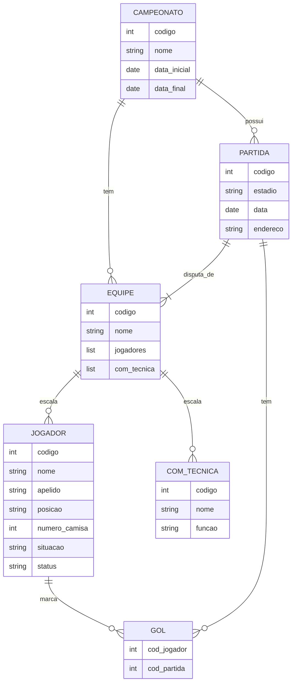

# BD Campeonato
## Construa o Diagrama Entidade Relacionamento para os requisitos:
- Um campeonato tem código, nome, data início e data final;
- Um campeonato tem várias equipes de futebol participando;
- Um campeonato tem várias partidas. Uma partida é disputada por duas equipes em um estádio, em uma data e endereço definidos;
- Cada equipe tem um código, nome, um conjunto de jogadores e um conjunto de membros na comissão técnica. Um jogador tem código, nome, apelido, posição. Um membro da comissão tem código, nome e função;
- Para cada partida a equipe tem uma escalação com um conjunto de jogadores escalados com o número da camisa, situação (titular ou reserva), status (jogou ou não jogou);
- Cada partida tem uma lista de gols informando o jogador escalado que fez o gol.



<!-- 
```mermaid
---
title: exemplos de relacionamento
---

erDiagram
    %% 1 para 1
    PERSON ||--|| PASSPORT : owns

    %% 1 para Muitos
    AUTHOR ||--o{ BOOK : writes

    %% Muitos para 1
    BOOK o{--|| PUBLISHER : published_by

    %% Muitos para Muitos
    STUDENT o{--o{ CLASS : attends

    %% Opcional para 1
    EMPLOYEE o|--|| DEPARTMENT : works_in

    %% Opcional para Muitos
    CUSTOMER o|--o{ ORDER : places
 -->  