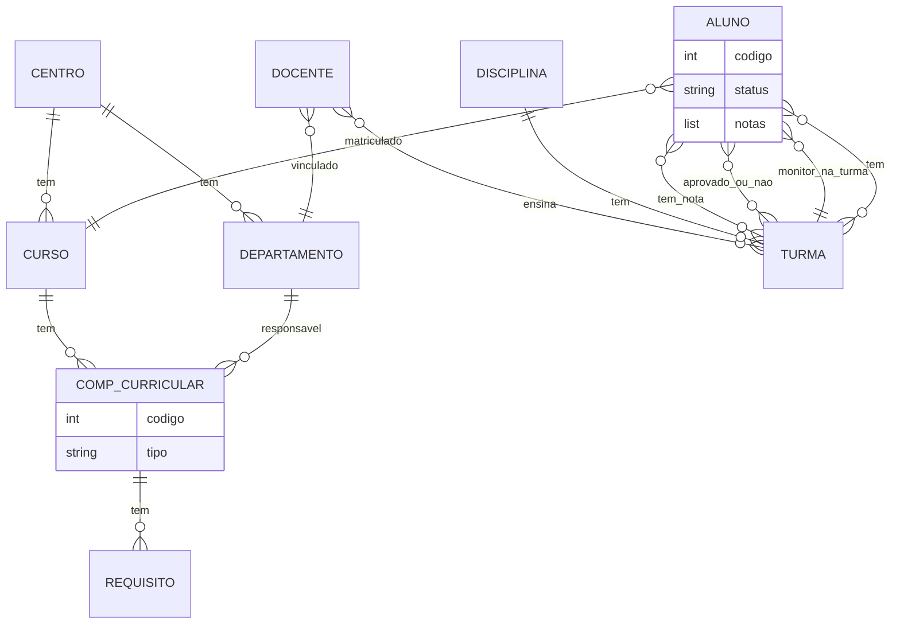

# BD Universidade
## Construa o Diagrama Entidade Relacionamento para os requisitos:

- Um centro tem um ou vários cursos;
- Um centro pode ter vários departamentos;
- Aluno está matriculado em apenas um curso;
- Um curso tem vários componentes curriculares;
- Um componente curricular pode ser do tipo - - Disciplina ou do tipo Atividade;
- Um componente curricular pode ter vários - - - requisitos (expressão de requisitos);
- Um departamento é responsável por várias - - - componentes curriculares;
- Docente ensina em muitas turmas;
- Turma pode ter mais de um docente;
- Turma tem muitos alunos;
- Turma é de uma Disciplina;
- Alunos podem estar em muitas Turmas;
- Uma turma pode ter mais de um aluno monitor;
- Um aluno monitor só trabalha em uma turma;
- Um docente está vinculado a apenas um Departamento;
- Um departamento tem muitos docentes;
- Um aluno tem 3 notas em uma turma e uma situação APROVADO OU REPROVADO;

