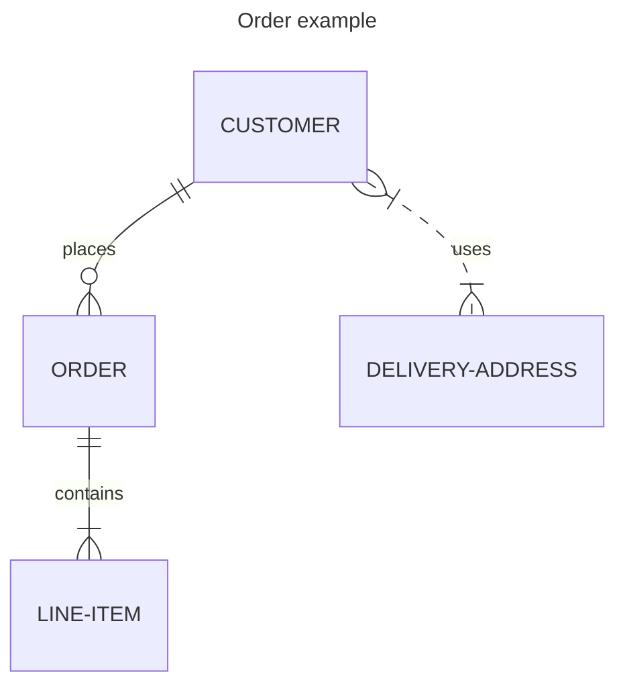

# Exemplo de Gráfico Mermaid ER

```mermaid
---
title: Quantidade dos Relacionamentos
---
erDiagram
    %% 1 para 1
    PERSON ||--|| PASSPORT : owns

    %% 1 para Muitos
    AUTHOR ||--o{ BOOK : writes

    %% Muitos para 1
    BOOK o{--|| PUBLISHER : published_by

    %% Muitos para Muitos
    STUDENT o{--o{ CLASS : attends

    %% Opcional para 1
    EMPLOYEE o|--|| DEPARTMENT : works_in

    %% Opcional para Muitos
    CUSTOMER o|--o{ ORDER : places


```
